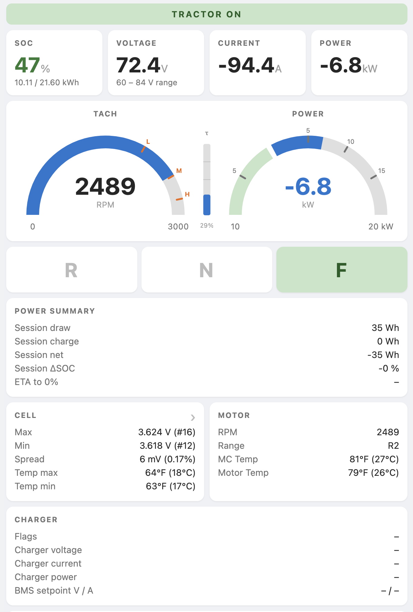
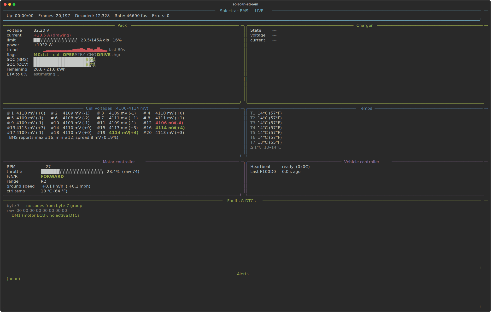

# CAN tooling for Solectrac tractors

J1939 CAN-bus tooling for a Solectrac electric tractor.

## Repository map

| Path | What it is |
| --- | --- |
| `solecan-analyze.py` | Offline batch decoder: CAN log → tidy CSVs. |
| `solecan-stream.py` | Live / replay dashboard. |
| `solecan_proto.py` | Shared J1939 decode core (SA/PGN map, scalings) — single source of truth for both tools. |
| `dashboard.html` | The canonical HTML dashboard; used by solecan-stream.py, the firmware, and Android app. |
| `bms/` | UDS diagnostics for the BMS port (separate bus). |
| `embedded/esp32-s3/` | ESP32-S3 firmware: WiFi dashboard, JSON, BLE, USB SLCAN, socketcand. |
| `android/` | Android app that mirrors the ESP32 dashboard over BLE. |
| `DOCUMENTATION.md` | Main-bus J1939 decode, CAN topology, OBD-II pinout, cluster hardware, vendor error-code tables. |

## Python tooling

Dependencies live in `pyproject.toml` (managed with `uv`). The base install
(`python-can`, `pyserial`, `rich`) is enough for the analyzer and stream TUI;
the `ble` and `canalyst` extras add `bless` and `canalystii` for the embedded
BLE work and the Canalyst-II adapter respectively, and `all` pulls in both.

```sh
uv sync                          # base
uv sync --extra all              # everything
pip install .                    # base, via pip
pip install '.[ble,canalyst]'    # everything, via pip
```

### `solecan-analyze.py` — offline decoder

```sh
python3 solecan-analyze.py [-o OUTDIR] file1.asc [file2.blf ...]
```

Inputs are read via `python-can`'s `LogReader`, so any format `python-can`
understands works: `.asc` (Vector ASCII), `.blf`, `.log` (canutils), `.trc`,
and python-can's own `.csv` format.

Outputs four CSVs (regenerated on each run) that together let you trace any
decoded value back to its source bytes and the formula that produced it:

* `signals.csv` — what we decoded (one row per scalar)
* `frames.csv` — what was on the bus (one row per consumed frame, joined to
  signals via `frame_index`)
* `decoders.csv` — how we decoded it (per-signal formula catalog)
* `can_ids.csv` — every unique CAN ID seen, with J1939 breakdown

To re-derive a value by hand: pick a row from `signals.csv`, look up its
`frame_index` in `frames.csv` to get the raw bytes, then look up its `signal`
in `decoders.csv` for the formula.

#### `signals.csv` — tidy long-format measurements

```
file, timestamp, frame_index, signal, value, unit
```

In [tidy / long format][tidy]. Pivot to wide from any consumer:

```python
import pandas as pd
df = pd.read_csv("signals.csv")
wide = df.pivot_table(index="timestamp", columns="signal", values="value")
```

Signal names use a `domain.name` (or `domain.NN.name`) convention —
`cell.NN.voltage_v`, `pack.voltage_v`, `motor.rpm_signed`, `bms.fault.code_NNN`,
`dm1.dtc.spn`, etc. The complete list with formulas, byte positions, and
confidence levels lives in `decoders.csv` (generated from the `DECODERS`
table in `solecan-analyze.py`); the decode itself is in `solecan_proto.py`.

[tidy]: https://vita.had.co.nz/papers/tidy-data.pdf

#### `frames.csv` — raw frame log

```
frame_index, file, timestamp, can_id, pgn, source, len, b0, b1, b2, b3, b4, b5, b6, b7
```

`can_id` is 8-hex (e.g. `18F100F3`), `pgn` is 4-hex, `source` is 2-hex,
each `bN` is the data byte at position N as 2-hex. One row per frame that
produced at least one signal.

#### `decoders.csv` — per-signal decode rule catalog

```
signal, pgn, source, bytes, formula, unit, confidence, notes
```

One row per signal name (parametric signals like `cell.NN.voltage_v` use
`NN` as a placeholder). `bytes` references positions within `frames.csv`'s
`b0..b7` columns. `confidence` is `verified`, `tentative`, or `unknown`.

#### `can_ids.csv` — per-unique-CAN-ID J1939 decode

```
id, ext, count, priority, R, DP, PF, PS, SA, PGN, PDU, PS_role, name
```

### `solecan-stream.py` — live dashboard

Live (or replayed) BMS / charger / motor dashboard. Decodes the same J1939
frames as `solecan-analyze.py` and serves a dashboard.




```sh
# Live capture using slcan
solecan-stream.py --interface slcan --channel /dev/cu.usbmodem101 --bitrate 250000

# Live capture using socketcan
solecan-stream.py --interface socketcan --channel can0 --bitrate 250000

# Replay an existing capture
solecan-stream.py --replay session.log
```

Displays pack voltage / current / DC and estimated AC power, BMS-published
SOC, charger output, per-cell voltages
with min/max/spread, module temperatures, vehicle-controller heartbeat, and
live alerts (low/high cell, spread, temp, AC budget, stale BMS).

### `bms/` — UDS diagnostics dashboard

Polls UDS Data Identifiers on the BMS's separate 2-pin diagnostic port in a
background thread and serves a localhost dashboard. Independent of the
main-bus tools and `solecan_proto.py`; its DID map lives in
[`bms/README.md`](bms/README.md).

```sh
python3 bms/solectrac-bms-diagnostics.py
```

## Embedded firmware — `embedded/esp32-s3/`

ESP32-S3 firmware that re-implements the main-bus J1939 decode in C++ and
exposes it five ways: WiFi HTML dashboard, JSON endpoint, BLE (Nordic UART
Service), USB SLCAN, and socketcand. Supports the Adafruit Feather S3 and the
LilyGo T-2CAN; board pin maps are `#ifdef`-selected. The shared
`dashboard.html` from the repo root is baked into the firmware binary at build
time.

The reproducible path is Docker (context = repo root, so the canonical
dashboard is included):

```sh
docker build -f embedded/esp32-s3/Dockerfile \
    --build-arg WIFI_SSID="..." --build-arg WIFI_PASS="..." -t solectrac-fw .
docker run --rm -v "$PWD/out:/out" solectrac-fw   # extracts bins to out/
```

Native PlatformIO also works (`pio run -e lilygo_t2can` /
`-e adafruit_feather_s3`). See [`embedded/esp32-s3/README.md`](embedded/esp32-s3/README.md)
for the full build, wiring, and flashing guide.

## Android app — `android/`

Mirrors the ESP32 web dashboard over BLE so the phone doesn't need to join
the tractor's WiFi. Loads the shared `dashboard.html` in a WebView and pipes
JSON snapshots from the NUS characteristic. Docker build:

```sh
docker build -f android/Dockerfile -t solectrac-android .
docker run --rm -v "$PWD/out:/out" solectrac-android   # APK -> out/
```

Native Gradle build is also supported. See
[`android/README.md`](android/README.md) for details.

## Disclaimer

This is a personal exercise based on observed CAN traffic. PGN meanings are
inferred from data and may be wrong.
