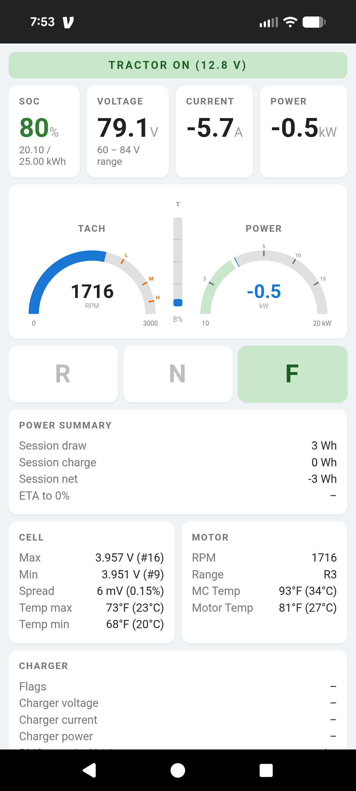

# Solectrac Android app

Mirrors the ESP32's web dashboard over BLE so the phone doesn't have to join
the `tractor` WiFi network. The app loads the same HTML inside a `WebView`
and pipes JSON snapshots — pushed from the ESP32's Nordic UART Service
whenever any displayed signal changes — into the page via a
`@JavascriptInterface` bridge.

The dashboard HTML lives at the repo root (`/dashboard.html`) and is shared
with the firmware; see "Shared dashboard HTML" in `CLAUDE.md`.



## One-time setup

The Gradle wrapper JAR is not checked in. From this directory:

```bash
gradle wrapper --gradle-version 8.7
```

(or open the project in Android Studio, which will materialize it for you).

## Build & install

```bash
./gradlew installDebug
```

## Reproducible Docker build

For a pinned, host-toolchain-independent build (JDK 17 + Gradle 8.7 +
Android SDK platform 34), use the Dockerfile. The build context is the
**repo root** because the Gradle build copies the canonical
`dashboard.html` from there.

```bash
docker build -f android/Dockerfile \
    --build-arg GIT_SHA=$(git rev-parse --short HEAD) -t solectrac-android .
docker run --rm -v "$PWD/out:/out" solectrac-android   # -> out/app-debug.apk
adb install out/app-debug.apk
```

The Docker build only produces the debug APK — release would need a
signing config that isn't checked in.

The git SHA is appended to `versionName` (e.g. `1.0+a1b2c3d`) and exposed
as `BuildConfig.GIT_SHA`. Native `./gradlew` builds resolve it from the
working tree automatically; omit the build-arg to ship `unknown`.

## Architecture

- `BleClient.kt` — scans for the NUS service UUID, connects to the first
  advertiser, negotiates MTU 517, subscribes to TX notifications, and
  reassembles framed messages (`[u16 BE length][payload]`).
- `MainActivity.kt` — hosts the WebView, manages runtime permissions, shows a
  status bar that auto-hides on connect, exposes the `DashboardBridge` JS
  interface, and forwards each JSON message via
  `window.dispatchDashboardUpdate(...)`.
- `assets/dashboard.html` — copied in from the repo-root canonical
  `dashboard.html` by the `copyDashboardAsset` Gradle task before each build.
  The destination is gitignored; edit the root file, not this one.

## Permissions

- Android 12+: `BLUETOOTH_SCAN` (with `neverForLocation`) and `BLUETOOTH_CONNECT`.
- Android ≤ 11: `ACCESS_FINE_LOCATION` (required for BLE scans on legacy APIs).

## Wire protocol

The ESP32 sends, on each change, a single logical message:

```
[u16 big-endian length] [length bytes of compact JSON]
```

split across N BLE notifications of up to ~180 bytes each. The Android client
buffers raw notification bytes and slices out whole frames using the prefix.
