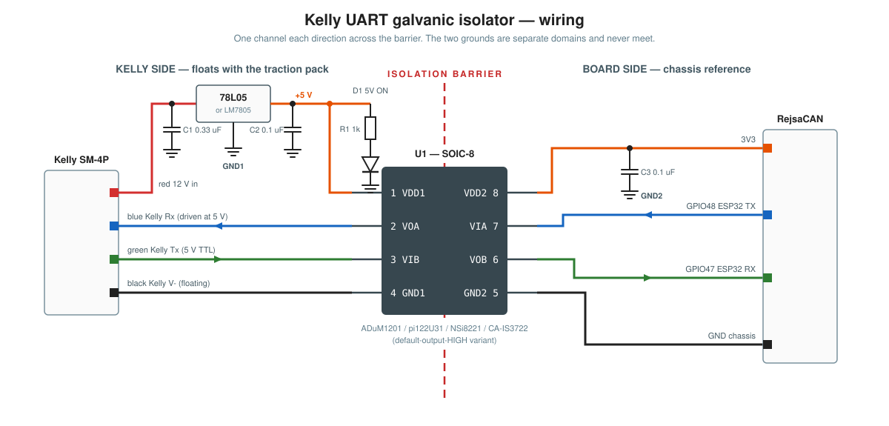
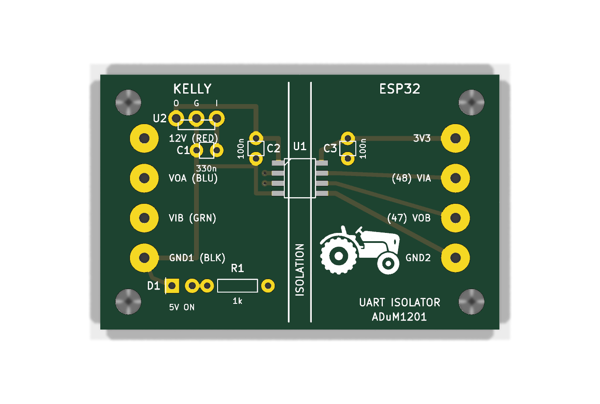

# Kelly UART isolator

A small dongle that lets an OBD-powered SoleCAN (RejsaCAN) read the Kelly
e-hydraulic controller's serial port reliably.

## Why

The Kelly KLS7218M is powered from the traction pack, so its V− is not at
chassis potential. The RejsaCAN, powered from the OBD port, is
chassis-referenced and must stay that way for CAN. Tying the two grounds
together injects chassis-to-traction noise into the UART's signal reference
and corrupts frames whenever the board runs on tractor power (see
`README.md` "Grounding dominates reliability"). A galvanic isolator removes
the ground connection entirely: the Kelly side floats with the pack, the
board side stays on chassis, and the two UART signals cross an isolation
barrier instead of sharing a reference.

## Parts

Board parts are about $3; ground shipping dominates, so buy spares. Prices
and stock are in `isolator-pcb/README.md`.

| Ref | Part | Purpose |
|-----|------|---------|
| U1 | [NSi8221N1-DSPR](https://www.digikey.com/en/products/detail/novosense/NSI8221N1-DSPR/22188706) digital isolator, SOIC-8 | Two UART channels, one each way, across the barrier. Fail-safe high: with the tractor off, GPIO47 sees a clean idle line and the firmware's stale-out handles key-off unchanged. |
| U2 | 78L05 regulator, TO-92 ([MC78L05ACPG](https://www.digikey.com/en/products/detail/onsemi/MC78L05ACPG/921041)) or LM7805, TO-220 | Makes the isolated 5 V rail from the ~12 V the Kelly puts out on SM-4P pin 1 (how Kelly's own Bluetooth dongle powers itself). Load is a few mA, no heat sink. Not a buck module: no efficiency case at 5 mA, and it would put switching hash next to the UART. |
| C1 | 0.33 µF 50 V X7R, 2.5 mm pitch ([TDK FA14X7R1H334KNU06](https://www.digikey.com/en/products/detail/tdk-corporation/FA14X7R1H334KNU06/5865807)) | Regulator input cap, right at U2. |
| C2, C3 | 0.1 µF 50 V X7R, 2.5 mm pitch ([Vishay K104K15X7RF5TL2](https://www.digikey.com/en/products/detail/vishay-beyschlag-draloric-bc-components/K104K15X7RF5TL2/286538)) | C2 is the regulator output cap; C3 decouples the 3.3 V board side of U1. |
| R1 | 1 kΩ 1/4 W axial ([Stackpole CF14JT1K00](https://www.digikey.com/en/products/detail/stackpole-electronics-inc/CF14JT1K00/1741314)) | LED current limit. |
| D1 | 5 mm green LED ([Kingbright WP7113SGC](https://www.digikey.com/en/products/detail/kingbright/WP7113SGC/1747672)) | Across the 5 V rail; lights only when the Kelly is powering pin 1, so it is a "Kelly is awake" indicator. |
| — | SM 2.5 4-pin plug with flying leads ([Amazon kit](https://www.amazon.com/dp/B0CLV48D6V)) | Mates with the Kelly's SM-4P port. |
| — | 4 hookup wires to the RejsaCAN | 3V3, GPIO48, GPIO47, GND. |

Tools: fine-tip soldering iron, thin solder, flux, tweezers, multimeter with
continuity beep, wire strippers. Solder wick is nice for the SOIC.

**U1 substitutes.** Any dual-channel isolator with one channel each way in
SOIC-8 with pins 1..8 = VDD1/VOA/VIB/GND1/GND2/VOB/VIA/VDD2, default-output
HIGH. Vendors number the three channel arrangements differently, so the
part numbers rhyme and mean opposite things. Only the middle column fits:

| vendor | 2 fwd / 0 rev (cannot UART) | 1/1, ADuM1201 pin order (**USE**) | 1/1, mirrored (not a drop-in) |
|--------|-----------------------------|-----------------------------------|-------------------------------|
| ADI | ADuM1200 | ADuM1201 ($4.82, the original) | — |
| 2Pai Semi | π120U31 | π122U31 ($0.26, LCSC only) | π121U31 |
| NOVOSENSE | NSi8220 | NSi8221 ($1.08, DigiKey) | NSi8222 |
| Chipanalog | CA-IS3720 | CA-IS3722 ($0.22, LCSC) | CA-IS3721 |
| NVE | IL711 | IL721 ($8.05, no defined key-off state) | IL712 |

## Wiring

| Kelly side (isolated, side 1) | Board side (chassis, side 2) |
|-------------------------------|------------------------------|
| VDD1 (1) ← 5 V from U2 | VDD2 (8) ← RejsaCAN 3V3 |
| VOA (2) → Kelly blue (Rx) | VIA (7) ← GPIO48 (TX) |
| VIB (3) ← Kelly green (Tx) | VOB (6) → GPIO47 (RX) |
| GND1 (4) ← Kelly black (V−) | GND2 (5) ← board GND |

Side 1 is **not** the mirror image of side 2; GND1 is pin 4, at the bottom.
Assuming otherwise put the wrong pinout on the rev A PCB.

## Assembly

Every name below is a silk label on the top side of the board:

### The isolator (U1)

Pin 1 is the **top-left** pad: the silk outline has a cut corner there, and
the chip's dot or bevelled edge goes to that corner.

1. Flux both pad columns.
2. Tin **one** pad (top-left is fine), place the chip with tweezers, reflow
   that pad while nudging the chip until all 8 leads sit centred on their
   pads.
3. Solder the diagonally opposite pin, recheck alignment.
4. Solder the remaining pins.

### R1 and D1

- **R1**: Solder R1 into the two `1k` holes.
- **D1**: the **square pad is the cathode** (the short leg, flat side of the
  LED rim). The long leg goes in the round hole next to `R1`.

### C1, C2, C3

Ceramic, no polarity. `330n` next to `U2` is C1; the two `100n` parts on
either side of the isolation line are C2 (Kelly side) and C3 (ESP32 side).
Push them in until they bottom out, solder, trim.

### The regulator (U2)

The silk reads `O G I` left to right: OUT, GND, IN.

- **78L05 (TO-92)**: flat side faces the bottom edge of the board (toward
  the `5V ON` LED), matching the silk outline. That puts the output leg in
  `O`. The datasheet's TO-92 drawing is a *bottom* view, so do not trust it
  as a front view.
- **LM7805 / L7805CV (TO-220)**: its IN and OUT are mirrored versus the
  78L05, so insert it facing the **opposite** way and match the legs to the
  letters: OUT in `O`, GND in `G`, IN in `I`.

If you get this wrong you will see ~9.7 V on the 5 V rail instead of 5 V and
the chip may not survive. Check under "Power-up check" before wiring the Kelly.

### Wires

All eight are round through-hole pads; strip 4 mm, tin, push through from
the top, solder on the bottom. Label both cables (`KELLY` / `REJSACAN`);
the finished dongle looks symmetric.

#### Kelly side: the SM 2.5 plug

The controller's SM-4P port is a male JST SM series, 2.5 mm pitch.

The kit's lead colours are **not** guaranteed to match the tractor harness,
so identify the pins by position, not colour. Looking into the controller's
port, the harness runs red, green, blue, black in pin order 1 to 4:

| SM-4P pin | Kelly signal | tractor colour | board pad |
|-----------|--------------|----------------|-----------|
| 1 | V+ (~12 V) | red | `12V (RED)` |
| 2 | Tx (controller out) | green | `VIB (GRN)` |
| 3 | Rx (controller in) | blue | `VOA (BLU)` |
| 4 | V− | black | `GND1 (BLK)` |

If in doubt, plug the pigtail into the controller with the key on and meter
it: pin 1 to pin 4 reads ~12 V, and that fixes the orientation of the other
two. Then recolour the leads with tape or heat-shrink to match the board
silk before soldering.

Note the board's pad order is **not** the harness order: blue and green are
swapped on the silk so the traces do not cross. Follow the silk. Twist
green+black and blue+red together, keep this cable under ~30 cm, and route
it away from the pump phase leads.

#### ESP32 side: the RejsaCAN

Use plain hookup wire (22–26 AWG). You may want an additional disconnect by
the SoleCAN for easy removal.

| board pad | RejsaCAN | note |
|-----------|----------|------|
| `3V3` | 3.3 V rail | powers the chip's board side |
| `(48) VIA` | GPIO48 | ESP32 TX → Kelly Rx |
| `(47) VOB` | GPIO47 | Kelly Tx → ESP32 RX |
| `GND2` | GND | chassis ground |

**Never tie GND1 to GND2.** Joining them defeats the whole board.

### Power-up check

Before plugging into the tractor, bench-test the Kelly side with 9–15 V DC
from a bench supply on the red/black leads (current limit 50 mA if you have
it):

- D1 lights.
- Meter `U2` pin `O` to `GND1 (BLK)`: **5.0 V** ± 0.25. If it reads ~9–10 V,
  U2 is in backwards.
- `GND1 (BLK)` to `GND2` is open.

Then power the ESP32 side from the RejsaCAN and confirm 3.3 V between `3V3`
and `GND2`.

### Box

Drill two 3/8" holes in the end panels of a box such as the Hammond 1591ATCL,
fit grommets, pass the cables through **before** soldering if you want a clean
job (or split the grommets). Mount the board on stick-on standoffs or VHB tape;
the corner holes are zip-tie points, not post holes.

## Done when

Flash the dashboard firmware with `-DENABLE_KELLY -DKELLY_DEBUG`, plug the
SoleCAN into the OBD port and watch `kelly_dbg` on `/json`: `frames_ok` should
climb at roughly 99% of polls.
